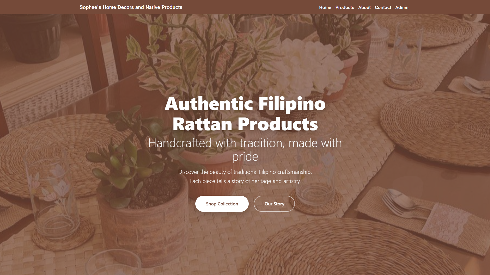
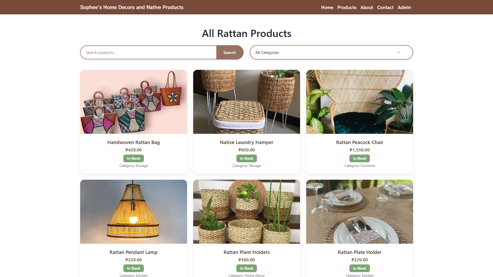
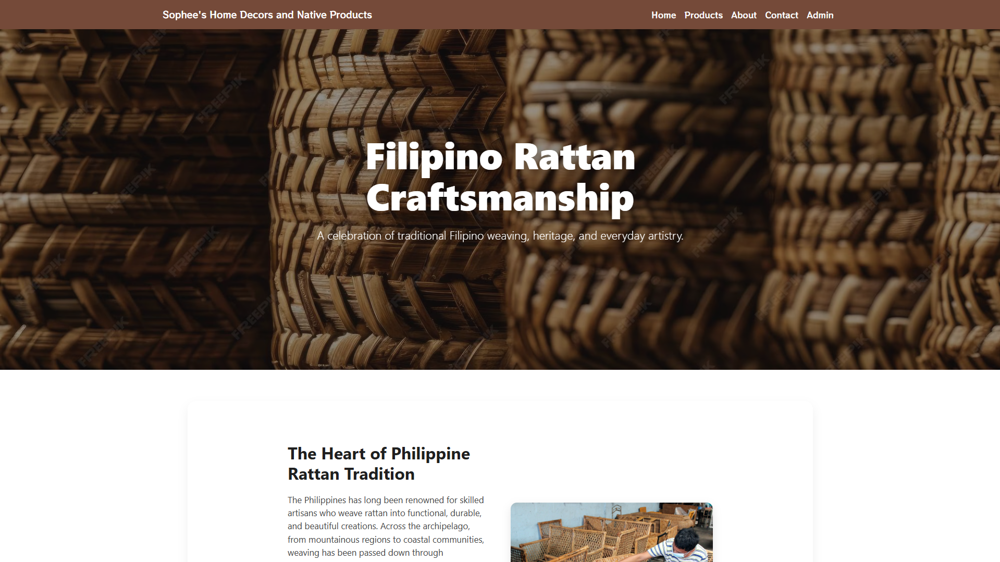
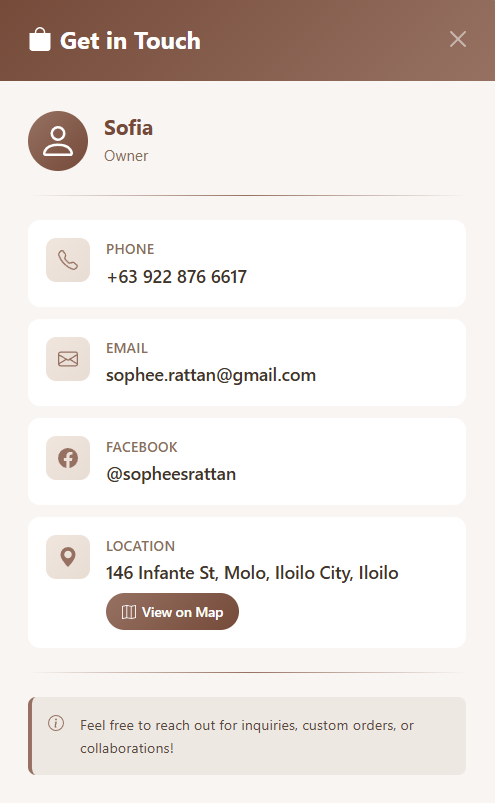
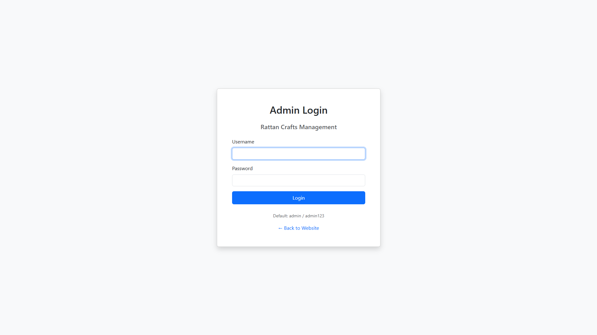
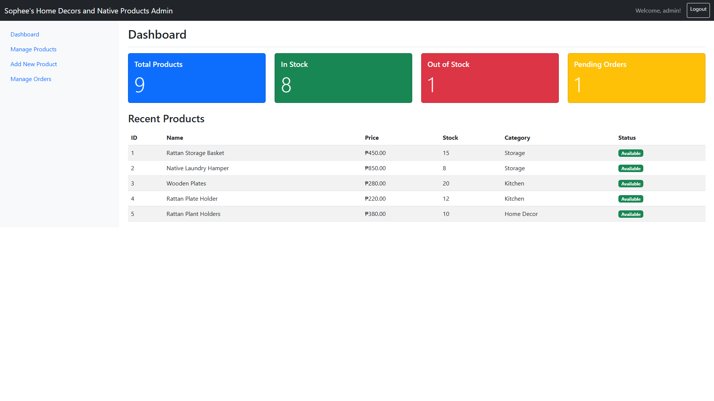
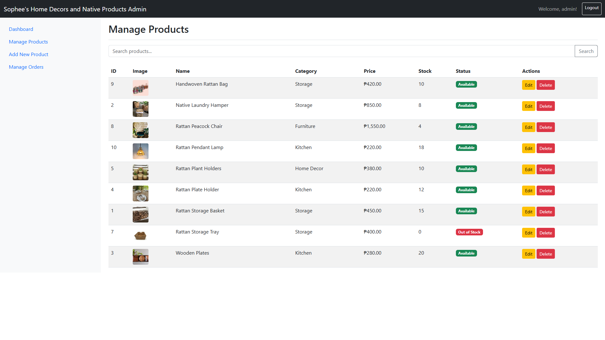
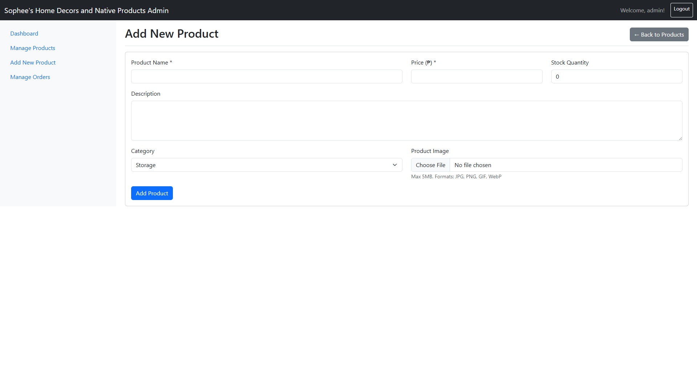
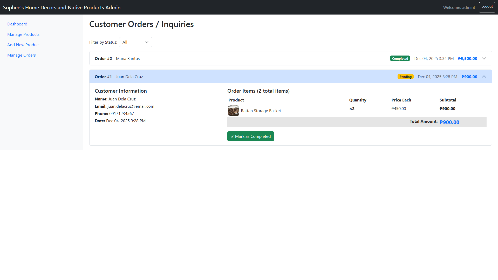

# 🇵🇭 Sophee's Home Decors and Native Products

## 📋 Project Overview
A Filipino culture-focused e-commerce website showcasing handcrafted rattan products with a complete admin dashboard for inventory management. This platform expands market reach for a Filipino rattan artisan business while promoting traditional craftsmanship and cultural heritage.

**Project Duration**: November 24 - December 17, 2024  
**Team Size**: 5 members  
**Course**: CC 201 - Introduction to Computing  
**Presentation Date**: December 17, 2025

---

## 🎯 Purpose and Target Audience

### Purpose
- Expand market reach for Filipino rattan artisan business
- Provide digital platform for product showcase and sales
- Streamline inventory management through admin dashboard
- Promote traditional Filipino craftsmanship and cultural heritage

### Target Audience
- Customers interested in authentic Filipino handicrafts
- Buyers seeking eco-friendly home décor
- Supporters of local Filipino businesses
- Cultural heritage enthusiasts

---

## 🏛️ Connection to Filipino Culture

**Traditional Craftsmanship**: Features centuries-old rattan weaving techniques passed down through generations

**Economic Impact**: Supports Filipino artisan families and local communities

**Cultural Preservation**: Promotes indigenous knowledge and traditional crafts

**Real Business**: Authentic products from a local entrepreneur (Sophee's business)

---

## ✨ Features

### Customer-Facing Pages
- **Homepage**: Hero section with featured products and call-to-action
- **Product Catalog**: Complete product listing with search and category filtering
- **Product Detail Page**: Detailed product information, images, pricing, and real-time stock status
- **About Page**: Story of Filipino rattan heritage and craftsmanship
- **Contact Modal**: Professional inquiry form

### Admin Dashboard
- **Secure Login**: Session-based authentication with 15-minute timeout
- **Dashboard Overview**: Statistics and recent products at a glance
- **Product Management**: Full CRUD operations with image upload
- **Order Management**: View and manage customer orders with detailed breakdowns

---

## 🔧 CRUD Operations

### ✅ CREATE
- Add new products with complete details
- Upload product images (validated file types and sizes)
- Create and track customer orders

### 📖 READ
- Display comprehensive product catalog
- View individual product details
- Show order list with expandable details
- Search products by name/description
- Filter products by category

### ✏️ UPDATE
- Edit product information through modal interface
- Update stock quantities
- Modify product prices
- Change order status (Pending, Processing, Completed)

### 🗑️ DELETE
- Remove products with custom confirmation modal
- Soft delete implementation to maintain data integrity
- Prevent accidental deletions

---

## 🌟 Key Features Highlights

- **Search Functionality**: Find products instantly by name or description
- **Category Filtering**: Browse by Storage, Kitchen, Home Decor, Furniture
- **Real-time Stock Status**: Dynamic "In Stock" / "Sold Out" badges
- **Responsive Design**: Optimized for mobile, tablet, and desktop devices
- **Custom Modals**: Professional UI with no default browser alerts
- **Session Security**: 15-minute auto-logout, bcrypt password encryption
- **Image Upload System**: Secure product photo management with validation
- **Cloud Database**: Aiven MySQL with SSL/TLS encryption

---

## 🛠️ Technology Stack

### Frontend
- **HTML5**: Semantic markup
- **CSS3**: Modern styling and animations
- **Bootstrap 5**: Responsive framework
- **JavaScript**: Interactive functionality

### Backend
- **PHP 7.4+**: Server-side logic
- **MySQL 8.0**: Relational database
- **PDO**: Database abstraction layer for security

### Infrastructure
- **Aiven Cloud Database**: Managed MySQL hosting
- **Apache Web Server**: HTTP server
- **XAMPP**: Local development environment

### Collaboration Tools
- **Git & GitHub**: Version control and collaboration
- **VS Code**: Primary code editor

---

## 📁 Project Structure

```
sophees-rattan-shop/
├── index.php
├── products.php
├── product_detail.php
├── about.php
├── contact.php
├── assets/
│   ├── css/
│   │   └── style.css
│   ├── js/
│   │   └── main.js
│   └── images/
│       ├── bgs/
│       └── products/
├── admin/
│   ├── login.php
│   ├── logout.php
│   ├── dashboard.php
│   ├── navbar.php
│   ├── sidebar.php
│   ├── products_manage.php
│   ├── orders_manage.php
│   ├── product_add.php
│   ├── product_edit.php
│   ├── product_delete.php
│   └── order_update.php
├── includes/
│   ├── db_connect.php
│   ├── header.php
│   ├── footer.php
│   └── functions.php
├── config/
│   └── db_config.php
├── database/
│   └── schema.sql
├── .gitignore
└── README.md
```

---

## 🚀 Installation

### Prerequisites
- PHP 7.4 or higher
- Aiven MySQL database account
- Apache (via XAMPP recommended)
- Git

### Setup Steps

1. **Clone Repository**
```bash
git clone https://github.com/SpekyLord/rattan-ecommerce-project.git
cd rattan-ecommerce-project
```

2. **Set Up Server**
- Move project folder to `htdocs/` directory (XAMPP)
- Start Apache server from XAMPP Control Panel

3. **Set Up Aiven Cloud Database**
- Log in to your [Aiven account](https://aiven.io)
- Access your MySQL service
- Note your connection details (host, port, username, password)
- Create database: `rattan_shop`
- Import schema: Execute SQL from `database/schema.sql`

4. **Configure Database Connection**
```bash
cd config
cp db_config.template.php db_config.php
# Edit db_config.php with your Aiven MySQL credentials
```

**Example db_config.php for Aiven:**
```php
<?php
define('DB_HOST', 'your-project-name.aivencloud.com');
define('DB_PORT', '12345'); // Your Aiven port
define('DB_NAME', 'sophees_shop');
define('DB_USER', 'avnadmin');
define('DB_PASS', 'your-secure-aiven-password');
?>
```

5. **Access Website**
- Customer Site: `http://localhost/rattan-ecommerce-project/`
- Admin Login: `http://localhost/rattan-ecommerce-project/admin/login.php`
  - **Username**: `admin`
  - **Password**: `admin123`

---

## 👥 Meet the Team

### Project Manager / Full Stack Developer

**Francis Gabriel Austria** - Team Lead & Full Stack
- Project architecture and planning
- Aiven cloud database integration
- Code integration and reviews
- GitHub repository management
- Product detail page development
- Mobile responsiveness optimization

---

### Frontend Development Team

**Lorin Mikaela Amaller Sernicula** - Frontend Developer
- Product catalog page development


**Mikay Cruz** - Frontend Developer
- Homepage design and hero section
- Product card design and layout

---

### Backend Development Team

**Ace Camariosa** - Backend Developer
- Image upload system
- Product CRUD operations


**Lucky Rey Tumbokon** - Backend Developer
- Session security implementation (15-min timeout)
- Order management system

---

## 📸 Project Screenshots

### User Interface
| Homepage | Products Page |
|----------|---------------|
|  |  |

| About Section | Contact Modal |
|---------------|---------------|
|  |  |

### Admin Dashboard
| Login | Dashboard |
|-------|-----------|
|  |  |

| Product Management | Add New Product |
|-------------------|-----------------|
|  |  |

| Order Management |
|------------------|
|  |

---

## 🔄 Git Workflow

### Branch Structure
```
main
├── dev
├── frontend-dev
└── backend-dev
```

### Daily Workflow
```bash
# Switch to your team branch
git checkout frontend-dev

# Get latest changes
git pull origin frontend-dev

# Create feature branch
git checkout -b feature/task-name

# Make your changes, then commit
git add .
git commit -m "Description of changes"

# Push to remote
git push origin feature/task-name

# Create Pull Request on GitHub for review
```

---

## 📊 Database Schema

### Tables (Normalized to 3NF)

```sql
-- Products Table
CREATE TABLE products (
    id INT PRIMARY KEY AUTO_INCREMENT,
    name VARCHAR(255) NOT NULL,
    description TEXT,
    price DECIMAL(10,2) NOT NULL,
    stock INT DEFAULT 0,
    category VARCHAR(100),
    image_path VARCHAR(255),
    active TINYINT DEFAULT 1,
    created_at TIMESTAMP DEFAULT CURRENT_TIMESTAMP,
    INDEX idx_category (category),
    INDEX idx_active (active)
);

-- Admin Users Table
CREATE TABLE admin_users (
    id INT PRIMARY KEY AUTO_INCREMENT,
    username VARCHAR(50) UNIQUE NOT NULL,
    password_hash VARCHAR(255) NOT NULL,
    created_at TIMESTAMP DEFAULT CURRENT_TIMESTAMP
);

-- Orders Table
CREATE TABLE orders (
    id INT PRIMARY KEY AUTO_INCREMENT,
    customer_name VARCHAR(255) NOT NULL,
    customer_email VARCHAR(255) NOT NULL,
    customer_phone VARCHAR(20),
    total_amount DECIMAL(10,2),
    status ENUM('Pending', 'Processing', 'Completed', 'Cancelled') DEFAULT 'Pending',
    created_at TIMESTAMP DEFAULT CURRENT_TIMESTAMP
);

-- Order Items Table
CREATE TABLE order_items (
    id INT PRIMARY KEY AUTO_INCREMENT,
    order_id INT NOT NULL,
    product_id INT NOT NULL,
    quantity INT NOT NULL,
    price DECIMAL(10,2) NOT NULL,
    FOREIGN KEY (order_id) REFERENCES orders(id) ON DELETE CASCADE,
    FOREIGN KEY (product_id) REFERENCES products(id)
);
```

**Database Features**:
- Normalized to Third Normal Form (3NF)
- Foreign key relationships for data integrity
- Indexed columns for optimized query performance
- Secure PDO prepared statements

---

## 🔐 Security Features

### Implemented Security Measures
- **Password Hashing**: Bcrypt encryption for admin passwords
- **SQL Injection Prevention**: PDO prepared statements throughout
- **XSS Prevention**: Output escaping and input sanitization
- **Session Management**: Secure 15-minute auto-logout
- **File Upload Validation**: Type checking and size limits for images
- **Cloud Database Security**: SSL/TLS encryption via Aiven
- **CSRF Protection**: Token validation for sensitive operations

---

## 🎯 Project Impact

### Business Value
- Functional e-commerce solution for real local business
- 24/7 product showcase and ordering capability
- Reduced manual inventory management overhead
- Expanded market reach beyond local area

### Cultural Significance
- Preservation of traditional Filipino craftsmanship
- Educational platform about rattan weaving heritage
- Support for local artisan economy
- Digital archiving of indigenous techniques

### Educational Outcomes
- Real-world full-stack development experience
- Team collaboration using industry-standard tools
- Practical application of web security principles
- Professional project management skills

---

## 📝 License
This project is developed for educational purposes as part of CC 201 - Introduction to Computing course.

---

## 📞 Contact
For questions, issues, or collaboration inquiries:

**Team Lead**: Francis Gabriel Austria  
[[Facebook](https://www.facebook.com/francisgabriel.austria/)]

---

**Built By BSCS - 1B Students | Celebrating Filipino Heritage Through Technology**